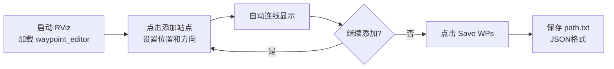
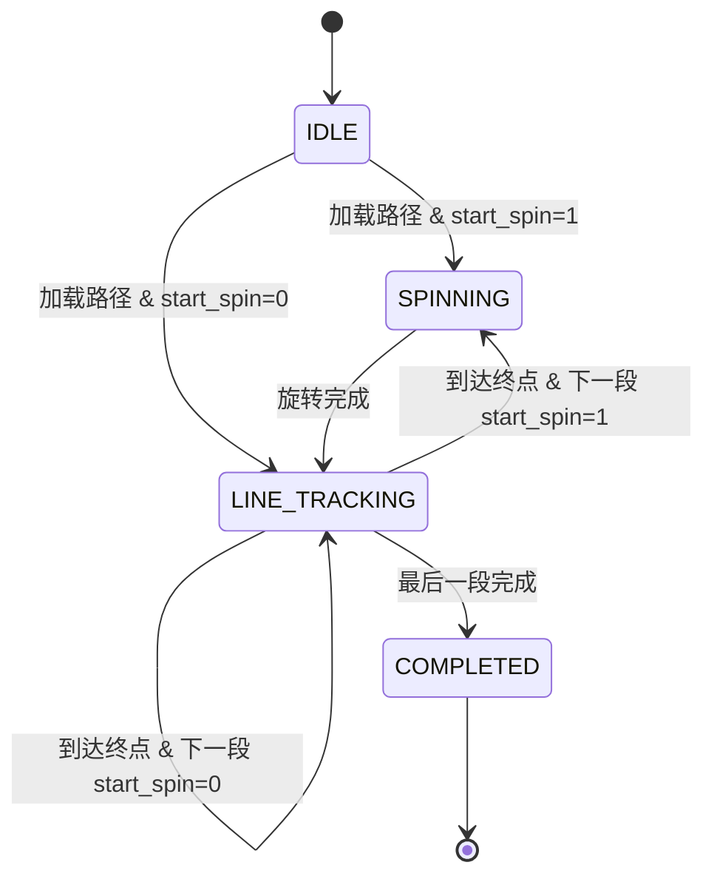

# AGV 矩形路径控制器设计

## 1. 目标

实现一个 AGV 控制器，能够：
1. **沿直线精确行走** - 矩形路径的每条边都是直线段
2. **节点处原地旋转** - 在路径段起点处，先旋转到该段路径方向，再直线行进
3. **平滑速度控制** - 采用 S 曲线加减速，避免急停急起

---

## 2. 路径文件格式 (JSON)

路径文件 `path.txt` 采用 JSON 格式存储，包含多个直线路径段：

```json
{
  "task_id": "rectangle_path_001",
  "paths": [
    {
      "dir": 1,                    // 移动方向: 1=正向, -1=倒退
      "target_v": 0.5,             // 目标速度 (m/s)
      "start_spin": 1,             // 起始旋转: 1=启用, 0=禁用
      "start_point": {
        "x": 0,                    // 起点 X (mm)
        "y": 0                     // 起点 Y (mm)
      },
      "end_point": {
        "x": 2000,                 // 终点 X (mm)
        "y": 0                     // 终点 Y (mm)
      }
    },
    {
      "dir": 1,
      "target_v": 0.5,
      "start_spin": 1,
      "start_point": { "x": 2000, "y": 0 },
      "end_point": { "x": 2000, "y": 2000 }
    },
    {
      "dir": 1,
      "target_v": 0.5,
      "start_spin": 1,
      "start_point": { "x": 2000, "y": 2000 },
      "end_point": { "x": 0, "y": 2000 }
    },
    {
      "dir": 1,
      "target_v": 0.5,
      "start_spin": 1,
      "start_point": { "x": 0, "y": 2000 },
      "end_point": { "x": 0, "y": 0 }
    }
  ]
}
```

### 字段说明

| 字段 | 类型 | 单位 | 说明 |
|------|------|------|------|
| `task_id` | string | - | 任务唯一标识 |
| `paths` | array | - | 路径段数组 |
| `dir` | int | - | 移动方向：1=正向，-1=倒退 |
| `target_v` | float | m/s | 该段目标速度 |
| `start_spin` | int | - | 起点是否旋转：1=旋转对准，0=不旋转 |
| `start_point.x/y` | int | mm | 起点坐标（毫米） |
| `end_point.x/y` | int | mm | 终点坐标（毫米） |

> [!NOTE]
> 坐标单位为**毫米**，程序内部转换为米进行计算。

---

## 3. 路径创建工具

使用 `waypoint_editor` RViz 插件在地图上直观设计路径，自动生成 JSON 格式路径文件。

### 工作流程



### 使用步骤

1. **启动 RViz 和 waypoint_editor 插件**

```bash
ros2 launch waypoint_editor waypoint_editor.launch.py
```

2. **加载地图**
   - 点击面板中的 **Load 2D Map** 或 **Load 3D Map** 按钮

3. **添加路径点**
   - 使用 waypoint_editor 工具在地图上点击添加站点
   - 每个站点包含位置 (x, y) 和方向 (yaw)
   - 站点之间会自动显示连线

4. **保存路径文件**
   - 点击面板中的 **Save WPs** 按钮
   - 选择保存位置，文件将以 JSON 格式保存为 `path.txt`

### 输出格式

保存的 `path.txt` 采用 JSON 格式，示例：

```json
{
  "task_id": "path_20241219_173000",
  "paths": [
    {
      "dir": 1,
      "target_v": 0.5,
      "start_spin": 1,
      "start_point": { "x": 0, "y": 0 },
      "end_point": { "x": 2000, "y": 0 }
    },
    {
      "dir": 1,
      "target_v": 0.5,
      "start_spin": 1,
      "start_point": { "x": 2000, "y": 0 },
      "end_point": { "x": 2000, "y": 2000 }
    }
  ]
}
```

### 默认参数

| 参数 | 默认值 | 说明 |
|------|--------|------|
| `dir` | 1 | 移动方向：1=正向 |
| `target_v` | 0.5 | 目标速度 (m/s) |
| `start_spin` | 1 | 起点旋转：1=启用 |
| 坐标单位 | mm | 自动从米转换为毫米 |
| 坐标系 | map | 所有位姿均在 map 坐标系下 |

---

## 4. 核心控制逻辑

### 4.1 状态机



**状态说明：**

| 状态 | 说明 | 输出 |
|------|------|------|
| `IDLE` | 待命，等待路径加载 | vx=0, ω=0 |
| `SPINNING` | 原地旋转，对准路径方向 | vx=0, ω≠0 |
| `LINE_TRACKING` | 直线跟踪行进 | vx≠0, ω由控制器计算 |
| `COMPLETED` | 所有路径段执行完毕 | vx=0, ω=0 |

### 4.2 单个路径段执行流程

```
┌─────────────────────────────────────────────────────────────┐
│                      Path Segment i                          │
├─────────────────────────────────────────────────────────────┤
│                                                              │
│  1. 计算目标航向                                              │
│     target_yaw = atan2(end.y - start.y, end.x - start.x)    │
│                                                              │
│  2. 如果 start_spin = 1                                      │
│     └─→ 进入 SPINNING 状态                                   │
│         └─→ 原地旋转至 target_yaw                            │
│             └─→ 旋转完成 (|角度差| < 阈值)                    │
│                                                              │
│  3. 进入 LINE_TRACKING 状态                                  │
│     └─→ Pure Pursuit 直线跟踪                                │
│         └─→ S曲线加速 → 匀速 → S曲线减速                     │
│             └─→ 到达终点 (距离 < 阈值)                        │
│                                                              │
│  4. 切换到下一段 Path Segment i+1                            │
│                                                              │
└─────────────────────────────────────────────────────────────┘
```

### 4.3 原地旋转控制 (SPINNING 状态)

```python
def spinning_control(current_yaw: float, target_yaw: float) -> tuple[float, float, bool]:
    """
    原地自旋控制
    
    Args:
        current_yaw: 当前航向角 (rad)
        target_yaw: 目标航向角 (rad)
    
    Returns:
        (vx, omega, is_done): 线速度, 角速度, 是否完成
    """
    # 角度差归一化到 [-π, π]
    angle_diff = normalize_angle(target_yaw - current_yaw)
    
    if abs(angle_diff) < ANGLE_TOLERANCE:
        return 0.0, 0.0, True  # 旋转完成
    
    # P控制 + 速度限幅
    omega = clamp(K_SPIN * angle_diff, -OMEGA_MAX, OMEGA_MAX)
    
    return 0.0, omega, False

def normalize_angle(angle: float) -> float:
    """归一化角度到 [-π, π]"""
    while angle > math.pi:
        angle -= 2 * math.pi
    while angle < -math.pi:
        angle += 2 * math.pi
    return angle
```

### 4.4 直线跟踪控制 (LINE_TRACKING 状态)

采用 **Pure Pursuit** 算法：

```python
def line_tracking_control(
    current_pose: Pose,      # 当前位姿 (x, y, yaw)
    line_start: Point,       # 线段起点
    line_end: Point,         # 线段终点
    target_v: float,         # 目标速度
    direction: int           # 方向: 1=正向, -1=倒退
) -> tuple[float, float, bool]:
    """
    直线跟踪控制
    
    Returns:
        (vx, omega, is_done): 线速度, 角速度, 是否到达终点
    """
    # 1. 计算路径方向向量
    path_vec = (line_end.x - line_start.x, line_end.y - line_start.y)
    path_length = hypot(path_vec[0], path_vec[1])
    path_yaw = atan2(path_vec[1], path_vec[0])
    
    # 2. 计算沿路径的投影距离（已行驶距离）
    to_current = (current_pose.x - line_start.x, current_pose.y - line_start.y)
    progress = (to_current[0] * path_vec[0] + to_current[1] * path_vec[1]) / path_length
    
    # 3. 到点判断
    dist_to_end = hypot(current_pose.x - line_end.x, current_pose.y - line_end.y)
    if dist_to_end < POSITION_TOLERANCE:
        return 0.0, 0.0, True  # 到达终点
    
    # 4. 计算前瞻距离
    current_speed = abs(target_v)  # 简化：使用目标速度
    ld = K_LD * current_speed + LD_MIN
    
    # 5. 计算前瞻点（在路径上距当前投影点 ld 距离）
    lookahead_progress = min(progress + ld, path_length)
    lookahead_point = Point(
        line_start.x + (lookahead_progress / path_length) * path_vec[0],
        line_start.y + (lookahead_progress / path_length) * path_vec[1]
    )
    
    # 6. Pure Pursuit 计算角速度
    dx = lookahead_point.x - current_pose.x
    dy = lookahead_point.y - current_pose.y
    alpha = atan2(dy, dx) - current_pose.yaw
    
    # 倒退时航向反转
    if direction == -1:
        alpha = normalize_angle(alpha + math.pi)
    
    curvature = 2 * sin(alpha) / ld
    
    # 7. S曲线速度规划
    vx = s_curve_velocity(progress, path_length, target_v) * direction
    omega = vx * curvature
    
    # 8. 限幅
    omega = clamp(omega, -OMEGA_MAX, OMEGA_MAX)
    
    return vx, omega, False
```

### 4.5 S曲线速度规划

```python
def s_curve_velocity(progress: float, total_length: float, target_v: float) -> float:
    """
    S曲线加减速规划
    
    Args:
        progress: 已行驶距离 (m)
        total_length: 路径总长度 (m)
        target_v: 目标速度 (m/s)
    
    Returns:
        当前速度 (m/s)
    """
    acc_ratio = 0.2  # 加速段占比
    dec_ratio = 0.2  # 减速段占比
    
    acc_dist = total_length * acc_ratio
    dec_dist = total_length * dec_ratio
    
    if progress < acc_dist:
        # 加速段: 使用平滑S曲线
        t = progress / acc_dist
        v = target_v * smooth_step(t)
    elif progress > total_length - dec_dist:
        # 减速段
        t = (total_length - progress) / dec_dist
        v = target_v * smooth_step(t)
    else:
        # 匀速段
        v = target_v
    
    return max(v, V_MIN)  # 保证最小速度

def smooth_step(t: float) -> float:
    """
    平滑阶跃函数 (S曲线)
    t ∈ [0, 1] → output ∈ [0, 1]
    """
    # 使用 smoothstep: 3t² - 2t³
    t = clamp(t, 0.0, 1.0)
    return t * t * (3 - 2 * t)
```

**速度曲线示意：**

```
速度 v
  │
  │     ┌─────────────┐
  │    /               \
  │   /                 \
  │  /                   \
  │ /                     \
  └─────────────────────────→ 距离 s
    加速段   匀速段   减速段
     20%     60%      20%
```

---

## 5. ROS2 接口设计

### 4.1 订阅话题

| 话题名 | 消息类型 | 说明 |
|--------|----------|------|
| `/odom` | `nav_msgs/Odometry` | 里程计，获取当前位姿 (x, y, yaw) |

### 4.2 发布话题

| 话题名 | 消息类型 | 说明 |
|--------|----------|------|
| `/cmd_vel` | `geometry_msgs/Twist` | 速度指令 (linear.x, angular.z) |
| `/agv/state` | `std_msgs/String` | 当前状态: IDLE/SPINNING/LINE_TRACKING/COMPLETED |
| `/agv/progress` | `std_msgs/Float32` | 路径完成进度 [0.0 ~ 1.0] |

### 4.3 服务

| 服务名 | 类型 | 说明 |
|--------|------|------|
| `/agv/load_path` | 自定义 srv | 加载 JSON 路径文件 |
| `/agv/start` | `std_srvs/Trigger` | 启动执行 |
| `/agv/stop` | `std_srvs/Trigger` | 停止并重置 |
| `/agv/pause` | `std_srvs/Trigger` | 暂停 |
| `/agv/resume` | `std_srvs/Trigger` | 恢复 |

---

## 6. 参数配置

```yaml
# config/agv_params.yaml
agv_controller:
  ros__parameters:
    # === 速度限制 ===
    max_linear_vel: 0.5       # 最大线速度 (m/s)
    min_linear_vel: 0.05      # 最小线速度 (m/s)
    max_angular_vel: 1.0      # 最大角速度 (rad/s)
    
    # === Pure Pursuit 参数 ===
    lookahead_gain: 0.5       # 前瞻距离增益 K_LD
    lookahead_min: 0.2        # 最小前瞻距离 (m)
    
    # === 到点阈值 ===
    position_tolerance: 0.05  # 位置容差 (m)
    angle_tolerance: 0.05     # 角度容差 (rad, ~3°)
    
    # === 旋转控制 ===
    spin_kp: 2.0              # 旋转P增益
    
    # === 控制频率 ===
    control_rate: 20.0        # 控制循环频率 (Hz)
    
    # === 定位源 ===
    odom_topic: "/odom"       # 定位话题
```

---

## 7. 数据流

```mermaid
flowchart LR
    subgraph Input
        A[path.txt<br>JSON文件]
        B[/odom<br>里程计]
    end
    
    subgraph AGV Controller
        C[路径解析器]
        D[状态机]
        E[旋转控制器]
        F[直线跟踪控制器]
        G[速度规划器]
    end
    
    subgraph Output
        H[/cmd_vel]
        I[/agv/state]
        J[/agv/progress]
    end
    
    A --> C --> D
    B --> D
    D --> E --> H
    D --> F --> G --> H
    D --> I
    D --> J
```

---

## 8. 文件结构

```
pp_controller/
├── CMakeLists.txt
├── package.xml
├── config/
│   └── pp_params.yaml
├── launch/
│   └── pp_controller.launch.py
├── include/
│   └── pp_controller/
│       ├── pp_node.hpp              # 节点头文件
│       ├── state_machine.hpp        # 状态机
│       ├── path_parser.hpp          # JSON 路径解析
│       ├── spin_controller.hpp      # 原地旋转控制
│       ├── line_tracker.hpp         # 直线跟踪控制 (Pure Pursuit)
│       └── math_utils.hpp           # 数学工具
└── src/
    ├── pp_node.cpp                  # ROS2 节点主入口
    ├── state_machine.cpp            # 状态机逻辑
    ├── path_parser.cpp              # JSON 路径解析
    ├── spin_controller.cpp          # 原地旋转控制
    ├── line_tracker.cpp             # 直线跟踪控制 (Pure Pursuit)
    └── math_utils.cpp               # 角度归一化、限幅等
```

---

## 9. 实现计划

| 阶段 | 内容 | 预计时间 |
|------|------|----------|
| **Phase 1** | 创建 ROS2 包骨架，参数加载 | 0.5h |
| **Phase 2** | 实现状态机 + 路径解析 | 1h |
| **Phase 3** | 实现原地旋转控制 | 0.5h |
| **Phase 4** | 实现 Pure Pursuit 直线跟踪 + S曲线 | 1h |
| **Phase 5** | Gazebo 仿真测试矩形路径 | 0.5h |

---

## 10. 确认清单

> [!IMPORTANT]
> 请确认以下设计选择后，我将开始实现代码：

- [x] 只需要直线 + 原地旋转（不需要贝塞尔曲线）
- [x] 路径文件采用 JSON 格式
- [x] 坐标单位为毫米 (mm)
- [x] 使用 `/odom` 作为定位源
- [x] 差速驱动模型 (vx, ω)
- [x] 路径从文件加载
- [x] 路径创建方式：使用 waypoint_editor RViz 插件
- [ ] 确认上述设计无误，可以开始实现

**请回复 "确认" 开始实现，或提出需要修改的地方！**

