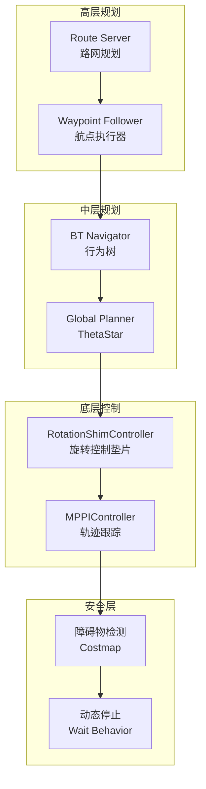

# 工业场景路网导航方案

## 目标需求

用户希望实现以下工业导航行为：
1. **沿路网直行** - 机器人沿预定义的路网路径直线行驶
2. **到点先旋转** - 到达路径点后，先原地旋转至下一段前进方向再启动
3. **遇障停止** - 检测到前方有人/障碍物时立即停止
4. **偏差追踪** - 偏离路径时自动追踪回正确位姿

---

## 现有系统架构

```
┌─────────────────────────────────────────────────────────────────┐
│                    当前导航架构                                   │
├─────────────────────────────────────────────────────────────────┤
│  Route Server (nav2_route)                                      │
│  ├─ GeoJSON 路网加载                                            │
│  └─ 可视化发布 /route_graph                                      │
│                                                                 │
│  Global Planner (ThetaStar)                                     │
│  ├─ 栅格地图路径规划                                             │
│  └─ 发布 /plan                                                   │
│                                                                 │
│  Local Controller (MPPIController)                              │
│  ├─ 预测控制轨迹生成                                             │
│  └─ 多 Critic 评估 (Obstacles/Path/Goal)                         │
│                                                                 │
│  Waypoint Follower                                              │
│  └─ 支持 follow_waypoints action                                 │
└─────────────────────────────────────────────────────────────────┘
```

### 当前配置文件

| 文件 | 用途 |
|------|------|
| [nav2_params.yaml](file:///home/suja/voxel_ws/src/robot_navigation/src/params/nav2_params.yaml) | Nav2 全栈配置 |
| [navigation.launch.py](file:///home/suja/voxel_ws/src/robot_navigation/src/launch/navigation.launch.py) | 导航启动文件 |
| [1126.geojson](file:///home/suja/voxel_ws/src/robot_route/maps/1126.geojson) | 路网定义 |

---

## 方案设计

> 评估补充（待你确认后再执行）
> - route_server 参数文件不要用 Nav2 的 params，需独立传入 `route_server.yaml`（避免路网加载异常）。
> - RotationShimController 要作为 FollowPath 插件，`primary_controller` 指向独立 MPPI 配置块，名称需一致；确认插件库可用后再替换。
> - 行为树 `industrial_nav.xml` 只有写在 BTNavigator 参数里才会生效，需在决定后设置 `default_bt_xml_filename`。
> - “沿路网走”若需要硬约束，建议加走廊/keepout filter（或路网采样生成 global_plan），否则 ThetaStar 仍可能走直线最短路。
> - 硬急停可结合 collision_monitor 或在 BT 增加高频障碍检查，否则仅靠 MPPI 软惩罚。

### 架构图



### 核心组件方案

#### 1. RotationShimController - 到点先旋转

> [!IMPORTANT]
> 这是实现"先旋转后前进"的关键组件

`RotationShimController` 是 Nav2 的控制器垫片，它会在主控制器接管前先进行原地旋转对准。

**工作原理:**
1. 收到新路径时，检测当前朝向与路径起始方向的角度差
2. 如果角度差 > `angular_dist_threshold`，执行原地旋转
3. 旋转完成后，将控制权交给 `primary_controller` (MPPI)

**配置参数:**
```yaml
controller_server:
  ros__parameters:
    controller_plugins: ["FollowPath"]
    FollowPath:
      plugin: "nav2_rotation_shim_controller::RotationShimController"
      primary_controller: "nav2_mppi_controller::MPPIController"
      angular_dist_threshold: 0.785  # 45度阈值触发旋转
      forward_sampling_distance: 0.5  # 采样距离计算目标朝向
      rotate_to_heading_angular_vel: 0.5  # 旋转角速度 rad/s
      max_angular_accel: 1.0  # 最大角加速度
      simulate_ahead_time: 1.0
      rotate_to_goal_heading: true  # 到达目标也旋转对准
```

#### 2. MPPIController 优化 - 路径跟踪

保持现有 MPPI 配置，启用 `PathAngleCritic` 增强角度对准：

```yaml
FollowPath:
  # ... RotationShimController 会自动传递给 primary_controller ...
  PathAngleCritic:
    enabled: true  # 启用！
    cost_power: 1
    cost_weight: 5.0
    offset_from_furthest: 4
    threshold_to_consider: 0.7
    max_angle_to_furthest: 0.785  # 45度
    mode: 0  # 考虑前进和后退
```

#### 3. 遇障停止 - 安全机制

**方案 A: 利用 MPPI ObstaclesCritic (软约束)**
- 已有配置，障碍物接近时自动减速
- `collision_cost: 40.0` 高惩罚确保避障

**方案 B: 行为树集成 Wait (硬约束) - 推荐**
- 使用自定义行为树在检测到障碍时触发 `Wait` 行为
- 需要自定义 BT 节点或使用 `IsPathValid` 条件节点

推荐配置:
```yaml
behavior_server:
  ros__parameters:
    behavior_plugins: ["spin", "backup", "drive_on_heading", "wait"]
    wait:
      plugin: "nav2_behaviors/Wait"
```

#### 4. 路网航点执行

**方案: Route → Waypoint Follower**

1. 从 Route Server 获取路网节点序列
2. 转换为 `PoseStamped[]` 发送给 `waypoint_follower`
3. 机器人依次导航到每个节点

**调用示例:**
```bash
# 计算路由
ros2 service call /route_server/compute_and_follow_route \
  nav2_msgs/action/ComputeAndTrackRoute \
  "{start: {x: 0, y: 0}, goal: {x: 5, y: 3}}"

# 或使用你的 waypoint_editor 发送航点
```

---

## 实施计划

### 第一阶段: 配置 RotationShimController

#### [MODIFY] [nav2_params.yaml](file:///home/suja/voxel_ws/src/robot_navigation/src/params/nav2_params.yaml)

将 `controller_server` 的 `FollowPath` 插件更换为 `RotationShimController`：

**变更内容:**
```diff
controller_server:
  ros__parameters:
    controller_plugins: ["FollowPath"]
    FollowPath:
-      plugin: "nav2_mppi_controller::MPPIController"
+      plugin: "nav2_rotation_shim_controller::RotationShimController"
+      primary_controller: "nav2_mppi_controller::MPPIController"
+      angular_dist_threshold: 0.785
+      forward_sampling_distance: 0.5
+      rotate_to_heading_angular_vel: 0.5
+      max_angular_accel: 1.0
+      simulate_ahead_time: 1.0
+      rotate_to_goal_heading: true
       # ... 保留原有 MPPI 参数 ...
```

---

### 第二阶段: 优化路径跟踪参数

#### [MODIFY] [nav2_params.yaml](file:///home/suja/voxel_ws/src/robot_navigation/src/params/nav2_params.yaml)

启用 `PathAngleCritic` 增强角度对准：

```diff
      PathAngleCritic:
-        enabled: false
+        enabled: true
         cost_power: 1
-        cost_weight: 2.0
+        cost_weight: 5.0
         offset_from_furthest: 4
         threshold_to_consider: 0.5
         max_angle_to_furthest: 1.0
         mode: 0
```

---

### 第三阶段: 创建工业导航行为树 (可选)

如果需要更精确的遇障停止控制，可以创建自定义行为树：

#### [NEW] [industrial_nav.xml](file:///home/suja/voxel_ws/src/robot_navigation/src/behavior_trees/industrial_nav.xml)

```xml
<root main_tree_to_execute="MainTree">
  <BehaviorTree ID="MainTree">
    <RecoveryNode number_of_retries="3">
      <PipelineSequence>
        <!-- 检查路径是否有效（无障碍） -->
        <RateController hz="2.0">
          <IsPathValid path="{path}"/>
        </RateController>
        <!-- 跟踪路径 -->
        <FollowPath path="{path}" controller_id="FollowPath"/>
      </PipelineSequence>
      <ReactiveFallback>
        <!-- 遇障等待 -->
        <Wait wait_duration="3.0"/>
        <!-- 清除代价图后重试 -->
        <ClearEntireCostmap name="ClearGlobalCostmap" service_name="global_costmap/clear_entirely_global_costmap"/>
      </ReactiveFallback>
    </RecoveryNode>
  </BehaviorTree>
</root>
```

---

## 验证计划

### 自动化测试

> [!NOTE]
> 当前代码库未发现现有的自动化测试用例，建议使用手动验证。

### 手动验证步骤

#### 测试 1: RotationShimController 旋转功能

1. 启动导航:
   ```bash
   source /home/suja/voxel_ws/install/setup.bash
   ros2 launch robot_navigation navigation.launch.py use_sim_time:=false
   ```
2. 在 RViz 中使用 `2D Pose Estimate` 设置初始位置
3. 将机器人朝向与目标方向设置为约 90 度角
4. 使用 `2D Goal Pose` 设置目标点
5. **预期结果**: 机器人应该先原地旋转对准目标方向，再开始前进

#### 测试 2: 遇障停止功能

1. 启动导航系统同上
2. 设置一个远距离目标点让机器人开始行驶
3. 在机器人前方放置障碍物（或让人站在路径上）
4. **预期结果**: 机器人应该在接近障碍物时减速并停止

#### 测试 3: 偏差追踪功能

1. 机器人在沿路径行驶时，手动推动机器人偏离路径约 0.5m
2. **预期结果**: 机器人应该自动调整回到正确路径上

#### 测试 4: 路网节点导航

1. 在 RViz 中确认路网可视化正常显示
2. 通过 waypoint_editor 选择路网节点作为航点
3. 点击执行导航
4. **预期结果**: 机器人依次到达每个路网节点，每个节点处旋转对准后再前进

---

## 参数调优指南

| 参数 | 说明 | 工业场景建议值 |
|------|------|---------------|
| `angular_dist_threshold` | 触发旋转的角度阈值 | 0.5-1.0 rad (30-60度) |
| `rotate_to_heading_angular_vel` | 旋转角速度 | 0.3-0.5 rad/s (安全优先) |
| `vx_max` | 最大线速度 | 0.3-0.6 m/s (仓库环境) |
| `collision_margin_distance` | 碰撞边际距离 | 0.1-0.2 m |
| `PathAngleCritic.cost_weight` | 角度对准权重 | 5.0-10.0 |

---

## 总结

本方案通过以下组合实现工业导航需求：

| 需求 | 解决方案 | 状态 |
|------|----------|------|
| 沿路网直行 | Route Server + Waypoint Follower | ✅ 已有 |
| 到点先旋转 | RotationShimController | 📝 待配置 |
| 遇障停止 | MPPI ObstaclesCritic + Wait Behavior | ✅ 已有 |
| 偏差追踪 | MPPI PathAlignCritic + PathFollowCritic | ✅ 已有 |

实施后机器人将具备符合工业安全标准的导航行为。
